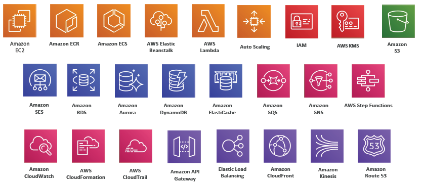
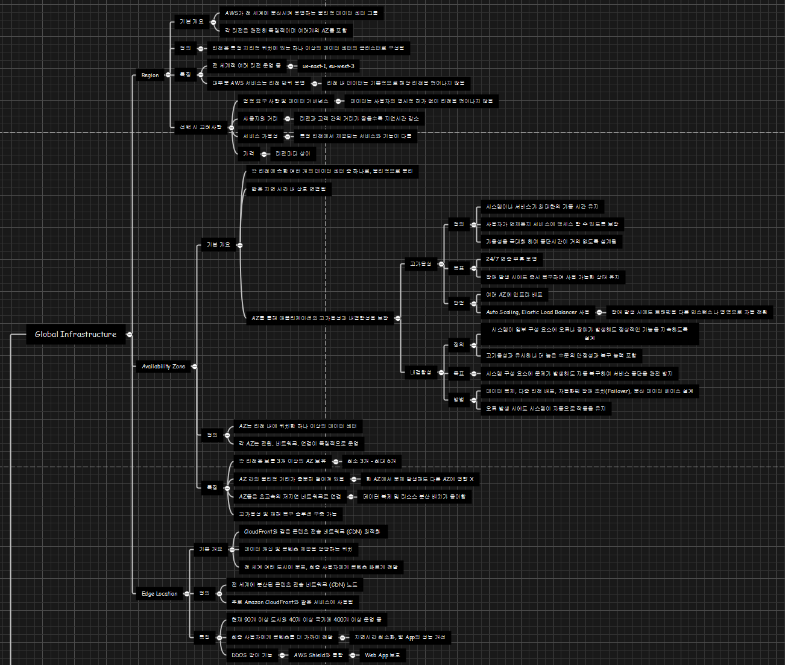

# AWS

AWS 정리를 시작하기에 앞서 AWS 란 무엇인가 정의를 해보아야 한다.

> 아마존 웹 서비스는 아마존닷컴의 클라우드 컴퓨팅 사업부이다. 아마존 웹 서비스는 다른 웹 사이트나 클라이언트측 응용 프로그램에 대해 온라인 서비스를 제공하고 있다. 
>
> [AWS 위키백과](https://ko.wikipedia.org/wiki/%EC%95%84%EB%A7%88%EC%A1%B4_%EC%9B%B9_%EC%84%9C%EB%B9%84%EC%8A%A4)

---

이를 보면 알겠지만, 너무 뜬 구름 잡는 소리라서 내 식대로 정의해보면

> 서버에 관련된 것을 모르는 사람들을 위해 하나씩 개발하던게 비즈니스 모델을 가지고 거대 자본이 투입되어 기존 방식보다 너무나도 저렴해져 보편적이 되어버린 거대한 컴퓨터 사업 - 필자 -

정도로 요약할 수 있지 않을까 싶다.

따라서 맨 처음에는 AWS는 서버에서 출발하여 이 서버를 대신 맡아주고, 유지보수를 해줬는데. 이렇게 유지보수 하던 것이 기능이 추가되고 서비스가 추가되다보니 현재의 수많은 아마존 서비스들이 나타나게 된 배경이 아닌가 싶다.

(윈도우에서 하니까 또 이미지 충돌 일어난다.)



아무튼 이러한 아마존 서비스를 잘 활용하면 우리는 다음과 같은 이점을 얻을 수 있다.

* 서버 계통으로 취업을 노리는 사람이라면 글로벌 대기업의 서버 맛을 봐야 한다.
* 직접 구현하다가 힘들어 죽겠으면 아마존을 찾으면 대부분 해결이 된다 
  * 이로 인해 많은 회사들이 망했다고 알고 있다.
* 서버가 구축이 되고 서버를 조작할 수 있는 능력만 된다면, 보안과 같은 복잡한 기능들은 이미 대부분 구현이 되어 서비스 개발에만 집중할 수 있게 만들어줬다.


이 처럼 잘 쓰면 무궁무진하게 좋고, 돈도 아낄 수 있는 수단이지만, 못 쓰면 이게 뭔지도 모르고 혼자 끙끙 앓다가 구현도 못하고 접을 수 있다는 뜻이다. 현재 주된 사항은 서버부터 DB까지 다 구현되어있으니 이를 공부하는 것이 아무래도 추후 개발이든 다른 분야든 적용하기엔 좋을 것 같아 시작한다.


일단 첫 잡소리는 여기까지 하고, 정리로 들어간다.

---

>  가장 기초적인 배경지식 아마존은 어떻게 서버를 구현이 되어있는가?
>
> > 이 중 어디서?를 중점으로 볼 것이다.

## Where? - Global

어디서 적용이 되는가는 사실 전세계적으로 적용되어있기 때문에 우리는 전세계가 아닌 **어떻게 구분이 지어졌나** 를 위주로 보아야 할 것이다.

이와 관련된 3가지 개념을 정리하고 넘어가겠다.

---

### Region

#### 기본 개요

1. Region은 AWS가 전 세계에 분산시켜 운영하는 물리적 데이터 센터 그룹
2. 각 리전은 완전히 독립적이며 여러개의 AZ를 포함한다.

#### 정의

> 리전은 특정 지리적 위치에 있는 하나 이상의 데이터 센터의 클러스터로 구성된다.

#### 특징

1. 전 세계적으로 여러 리전을 운영중이다
   1. 대표적으로 ```ap-northeast-2```은 아시아 서울이다.
2. 대부분 AWS 서비스는 리전 단위로 운영된다
   1. 리전 내 데이터는 **기본적으로 해당 리전을 벗어나지 않는다**.

#### 선택 시 고려사항

1. 법적 요구 사항 및 데이터 거버넌스

   1. 데이터는 사용자의 명시적 허가 없이 리전을 벗어나지 않는다.

2. 사용자와의 거리

   1. 리전과 고객 간의 거리가 짧을수록 지연시간 감소

3. 서비스 가용성

   1. 특정 리전에서 제공되는 서비스와 기능이 다름

4. 가격

   1. 리전 마다 상이함

   ---

   

### Availability Zone

#### 기본 개요

* 각 리전에 속한 여러 개의 데이터 센터 중 하나로, 무리적으로 분리됨

* 짧은 지연 시간 내 상호 연결됨

* AZ를 통해 애플리케이션의 **고가용성과 내결함성**을 보장함

  * **고가용성(High Availability)**이란?

    * > 시스템이나 서비스가 최대한의 가동시간을 유지하여 24/7의 서비스 운영이 목표
      >
      > 장애 발생 시에도 즉각 대처(복구) 및 서비스 운영 가능

  * **내결함성(Fault Tolerance)** 이란?

    * > 시스템이 일부 구성 요소에 오류나 장애가 발생해도 정상적 기능을 지속하도록 설계
      >
      > 고가용성과 유사하나 더 높은 수준의 안정성과 복구 능력이 포함됨

#### 정의

> AZ는 리전 내에 위치한 하나 이상의 데이터 센터
>
> 각 AZ는 전원, 네트워크, 연결이 독립적으로 운영됨

#### 특징

* 각 리전은 보통 3개 이상의 AZ 보유 -> 최소 3 ~ 최대 6개
* AZ 간의 물리적 거리가 충분히 떨어져 있어 한 AZ에서 문제 발생해도 다른 AZ에 영향 X
* AZ들은 초고속의 저지연 네트워크로 연결 -> 데이터 복제 및 리소스 분산 배치 용이
* 고가용성 및 재해 복구 솔루션 구축 가능

---


### Edge Location

#### 개요

* CloudFront와 같은 콘텐츠 전송 네트워크(CDN) 최적화
* 데이터 캐싱 및 콘텐츠 제공을 담당하는 위치
* 전 세계 여러 도시에 분포, 최종 사용자에게 콘텐츠 빠르게 전달

#### 정의

> 전 세계에 분산된 콘텐츠 전송 네트워크 노드
>
> 주로 Amazon CloudFront와 같은 서비스에서 사용됨

#### 특징

1. 현재 90개 이상 도시와 40개 이상 국가에 400개 이상 운영중
2. 최종 사용자에게 콘텐츠를 더 가까이 전달 가능
   1. 지연시간 최소화, 웹 App의 성능 개선
3. DDOS 방어 기능
   1. AWS Shield와 통합
      1. Web, App 보호

---


우선은 이 정도로 AWS 정리 시작하고 다음에 계속 업데이트 하는 방식으로 진행하겠다. 

P.S 마인드맵 작성하는 것도 개오래 걸림...


